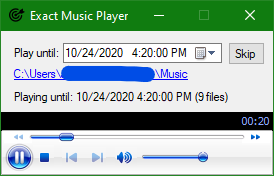

# Exact Music Player

Adjusts the playlist to finish the last song at *exactly* the specified time.

Just select the time to play music until, select a folder with music files, and the player will stop playing at the specified time.

## Screenshot

